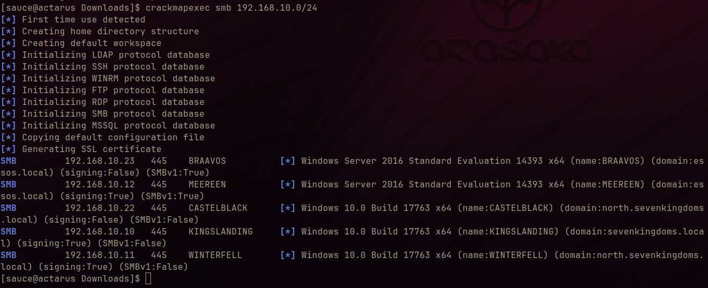
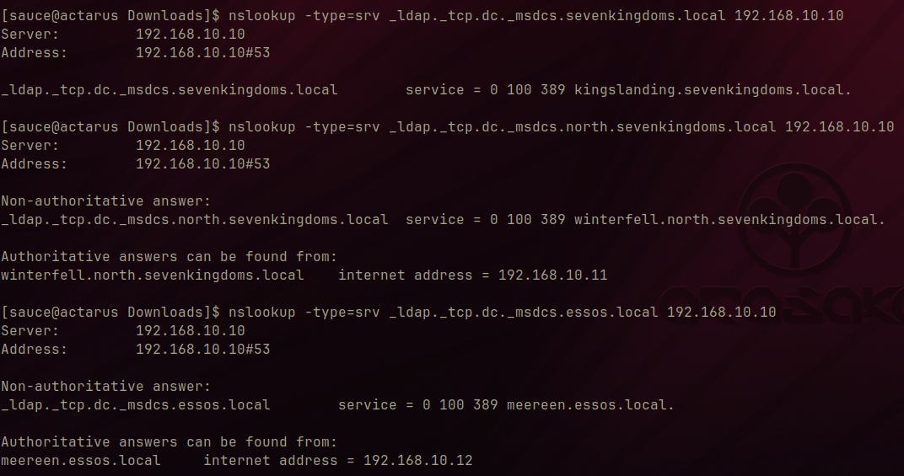
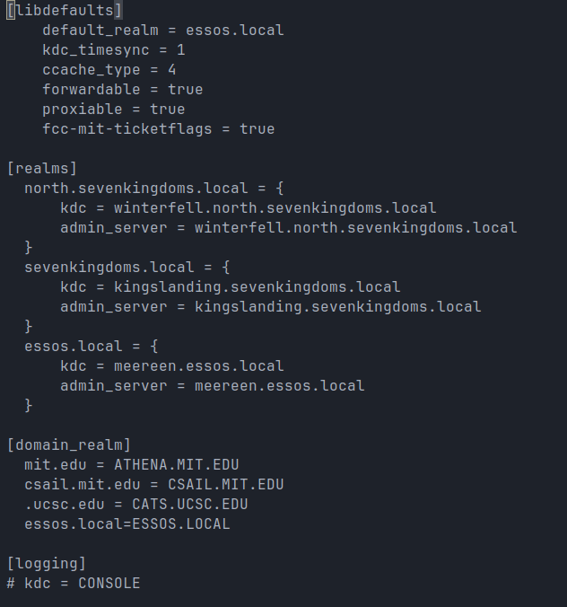
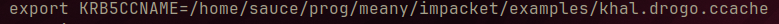
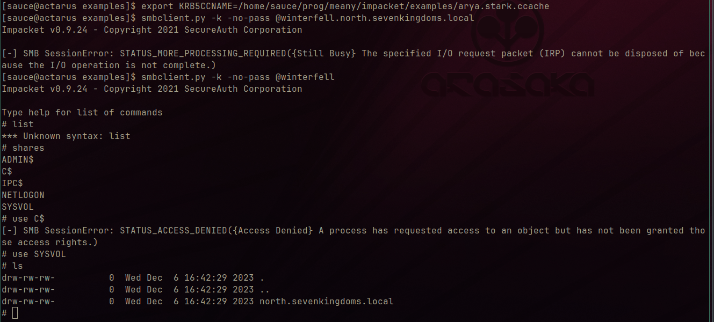
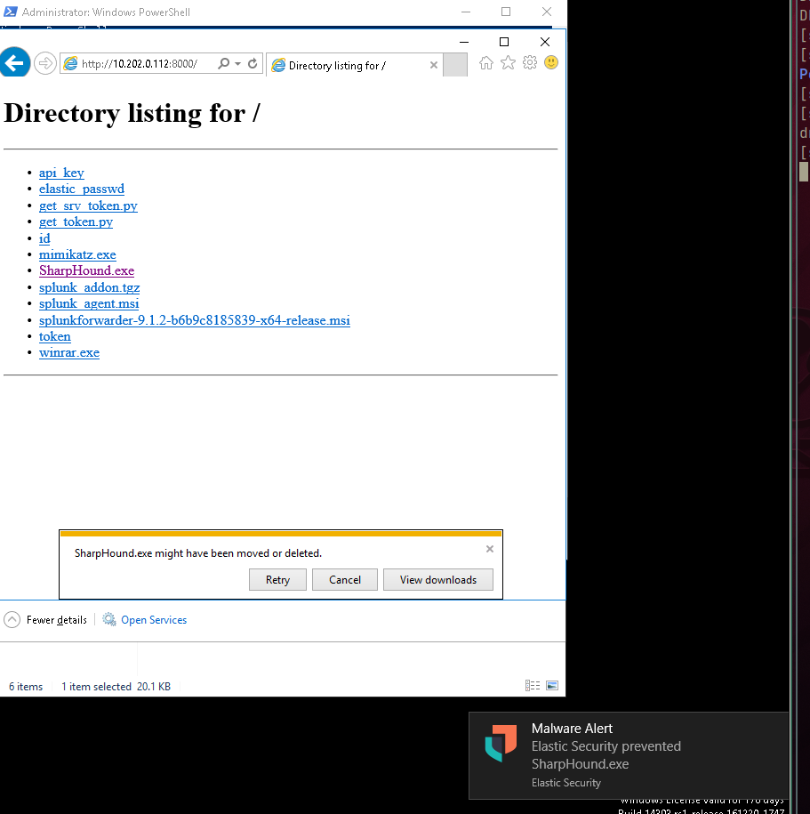
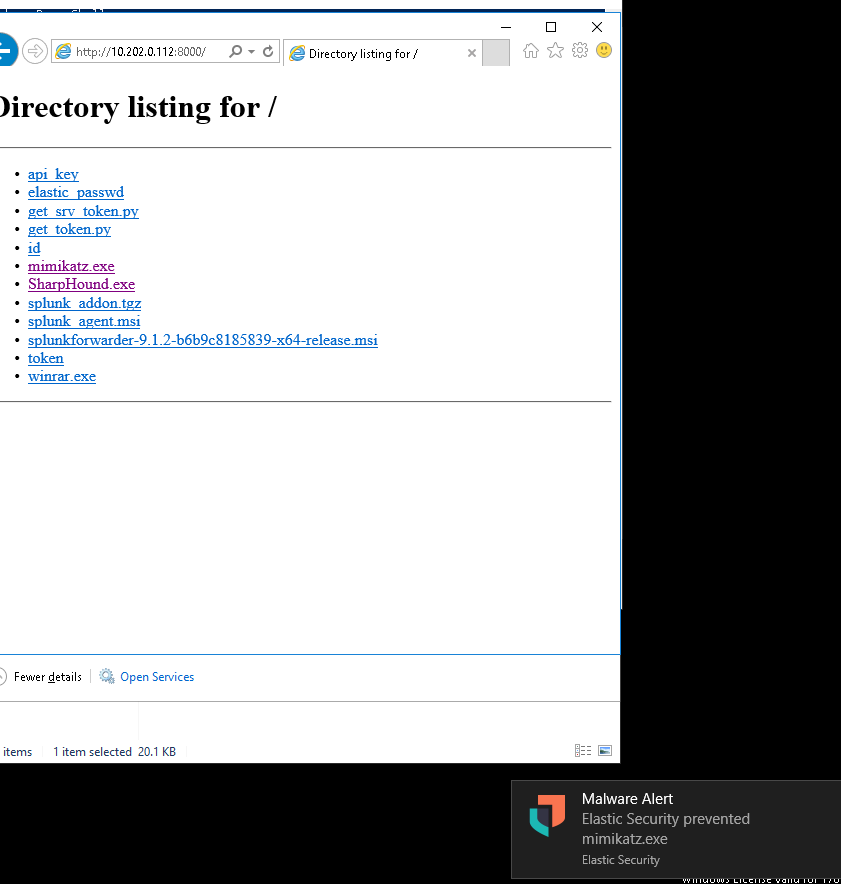
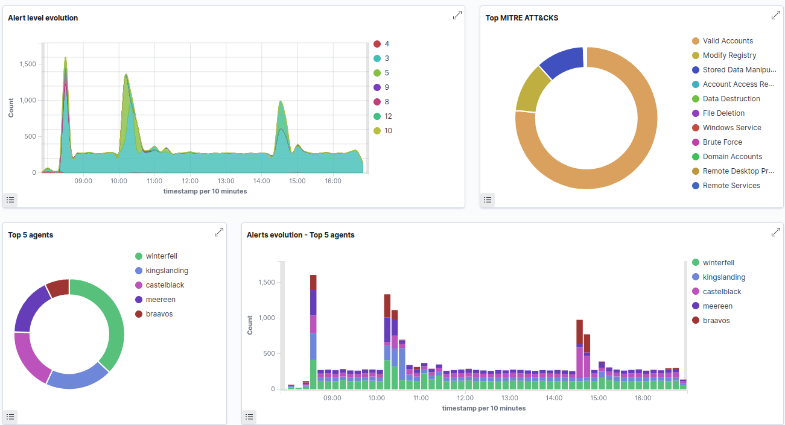
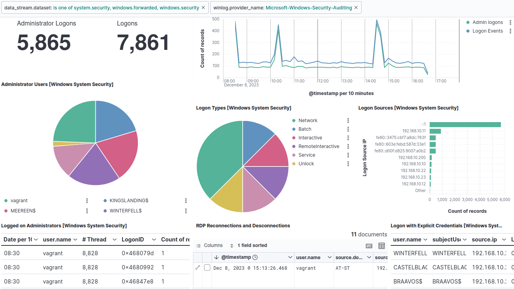
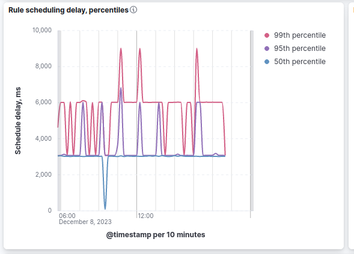

# Attaques GOAD


## Reconnaissances active

### crack map exec

Pour commencer l'énumération nous allons utiliser l'utilitaire [crackmapexec](https://github.com/byt3bl33d3r/CrackMapExec) qui est un outils permettant de forger des trames réseau simplement et donc d'obtenir certaines informations intéresantes.

Nous allons alors commencer par faire une reconnaissance sur le protocole smb sur l'entièreté sur réseau qui nous as été donné:
```bash
./crackmapexec smb 192.168.10.0/24
```



on connait alors les différents serveurs, leurs OS, la version de smb qu'ils exposent ainsi que leurs hostname et leurs ip
### nslookup

On va ensuite utiliser nslookup afin de réaliser des requêtes dns et trouver les DC.
```bash
nslookup --type=srv _ldap._tcp.dc._msdc.sevenkingdoms.local 192.168.10.10
```
- --type srv permet de préciser le type de notre requête (record) au même titre que A MX ou TXT

- _ldap._tcp.dc._msdc.sevenkingdoms.local est l'addresse que nous souhaitons résoudre, ici les dc du domaine sevenkingdows mais nous exécurterons la même requêtes sur les dommaines essos.local et nort.sevenkingdoms.local

- 192.168.10.10 est l'addresse ip du résolveur interne à GOAD





on a donc la confirmation des différents DC du dommaine


### kerberos

Pour continuer nous configurerons kerberos sur notre poste attaquant pour tenter de nous connecter au partage smb découverts.

nous modifierons alors le fichier krb5.conf comme suis:





puis nous utiliserons les examples de la solutions [impacket](https://github.com/fortra/impacket) pour récupérer un TGT puis nous connecter au share.


d'abord avec la classe **getTGT**

```bash
getTGT.py essos.local/khal.drogo:horse
```


puis en exportant la variable d'environement du path du fichier ainsi créé dans KRB5CCNAME



puis en lançant le classe **smbclient** avec l'option -k pour préciser une authentification kerberos en utilisant le TGT obtenu précédemment.

*n.b*: la classe se sert de la variable d'environement précédemment définie pour localiser le tgt



on peut ainsi accéder au share exposé avec le TGT de l'utilisateur.

### enum4linux

Nous continuerons notre reconnaissance avec l'outils [enum4linux](https://github.com/CiscoCXSecurity/enum4linux) qui automatise la récupération d'information au travers d'un script.

on aura par exemple lister les utilisateurs comme avec crackmapexec( flag --users)

mais aussi la policy de mot de passe les groupes et les users qu'il comprends

```bash
enum4linux 192.168.10.11
```


### mimikatz et sharphound 

Pour finir nous allons utiliser des méthodes beacoup plus bruillantes pour faire allumer les Seims. Pour commencer nous allons ouvrir un serveur web avec le module python http.server afin de pouvoir télécharger les fichiers sur un DC.
```
python3 -m http.server
```

on s'y connecteras alors sur le port 8000





Malheureusement (où plustôt devrions nous dire heureusement) on peut voir que elastic defend détecte les deux exécutables comme des malwares.

son action est prise avec le mode ***prevent*** sélectionné

## Aanalyse sur les Siem

Les attaques d'énumération actives ont été menées aux alentour des 10h AM et les attaques plus lourdes ont été menés aux alentour des 3h PM. On peut repérer que sur les différents SIEM, les attaques resortent au différents pics horaires.

### Wazuh

On voit des pics significatifs aux horaires des attaques:




### elastic

On peut analyser deux dashboard intéressants

### windows_security

L'intégration windows remonte les évènements de sécurité qui peuvent être monitorés comme suis:




### elastic_defend

L'intégration elastic defend quand à elle remonte plus d'information et notament l'attaque enum4linux qui n'est pas détectée par les autres siem, lancée aux alentour de midi:




## perpective d'évolution


Avec le club cyber nous aimerions monter un environement GOAD et essayer de le compléter sans walkthrough et essayer de voir les détection des siems peut être dans l'objectif, en fin d'année
d'en faire un CTF entre participants du club cyber avec une Blue-team et une red-team qui devra défendre et prévenir.

J'aurais aimé avoir plus de temps pour pouvoir découvrir et mieux comprendre les attaques sur l'environnement Active directory et je pense passer quelques stream dans cette perspective.