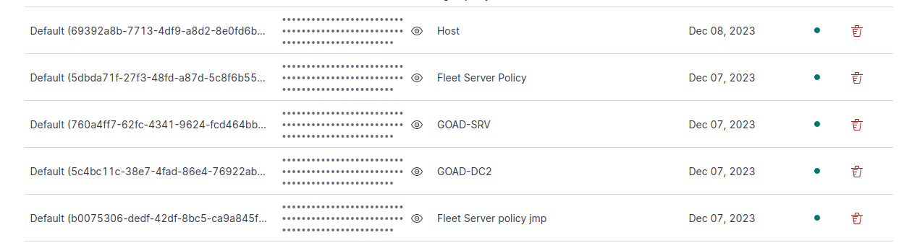

# déploiement de la stack ELKS

## installation de base

pour commmencer je me suis penché sur l'automatisation du lancement des script utilisés dans les tp de supervision sec. Pour commencer les dépendances seront intallées afin d'assurer le déploiement puis le script clonera le git sur l'hôte distant puis lancera le les différentes installations (ES, siem et fleet).

il est possible de retrouver le playbook [ici](../playbooks/elastic-deploy.yml)

## jointe des agents

### server side

Par la suite je me suis concentré sur la posibilité d'automatiser le téléchargement des agents sur les DC et SRV du GOAD et leurs bonne intégration dans les diverses policies.

j'ai donc trouvé la documentation [suivante](https://www.elastic.co/guide/en/fleet/current/fleet-enrollment-tokens.html) rensegnant les la jointe et la création de policies. J'ai donc créé un script [python](../roles/elastic-server/files/create_dc_policy) pour envoyer de manière beaucoup plus esthétiques et compréhensible la requête POST à l'api kibana. J'ai pu ajouter directment à cette requêtes les différentes intégrations nécessaires ([windows](https://docs.elastic.co/en/integrations/windows) et [defend](https://docs.elastic.co/en/integrations/windows))

J'ai du au préalable créer une [clef d'api](https://www.elastic.co/guide/en/elasticsearch/reference/current/security-api-create-api-key.html) qui ajout une couche de sécurité supplémentaire.

enfin un script python se charge de récupérer le token d'enrollement et de le placer dans le répertoire files du role avec la syntaxe jinja2. 

### agent side

les agent sont téléchargés sur les différents postes et le token d'enrollement est ensuite placés avec la j2. j'ai placés différentes opération de contrôle afin d'assurer le bon déroulement de l'exécution comme par exemple la vérification de la présence de l'archive de l'agent qui évite de le re télécharger ou encore la présence du réportoire qui permet d'éviter l'étape d'extraction en cas de problèmes d'enrollement.

## perspectives d'améliorations

le seul problème que je rencontre est l'ajout de la CA et de son empreinte ainsi que la modification des paramètres d'output du server fleet. Je pense qu'il est possible de l'automatiser avec l'api mais je n'ai malheureusement pas eut le temps de l'intégrer.

## Résultats

après le déploiement on obtient les informations de fleet suivantes:

les noeuds sont en unhealthy car je n'ai pas passé l'option de non vérification des certificats.

les policy sont automatiquement créées:

avec les token d'enrollement associés:

il faut néanmoins modifier les outputs dans les settings pour que le déploiement soit opérationnel

*remarque:* on pourrait utiliser le résolveur au lieu de l'ip vu que l'environement AD comprenait un DNS.