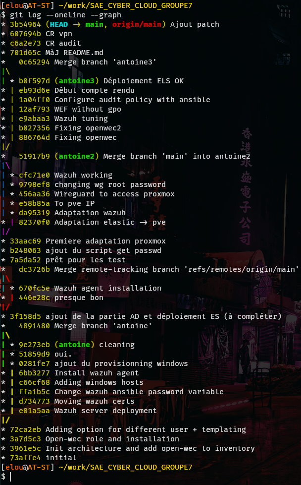

# Versioning avec GIT
Pour pouvoir collaborer efficacement et garder des versions différents de notre travail nous avons utilisé git. On peut voir par les différentes branches que nos travaux ont divergés mais grâce à git nous n'avons pas eu de mal à fusionner nos changements.



## Git patch

Pour pouvoir pousser les changements fait sur des machines qui ne possèdent pas nos clé privé nous avons appris à utiliser les 'patch' de git. Une fois tout le travail dans un commit on crée le fichier patch avec :
```bash
git format-patch HEAD~X
```
En remplaçant X par le nombre de commits que l'on souhaite extraire. Ensuite on copie les fichiers généré sur un ordi pouvant pousser les changement et on crée une nouvelle branche que l'on ramène aux commits juste avant les patchs :
```bash
git branch antoine4
git checkout antoine4
git reset --hard <id_commit>
```
Puis on applique les fichiers patch (un par commit) :
```bash
git apply commit.patch
git add .
git commit -m "commentaire"
```
Enfin on retourne sur la branche principal et on merge la branche de patch en réglant les confilts si besoin :
```bash
git checkout main
git merge antoine4
git push
```