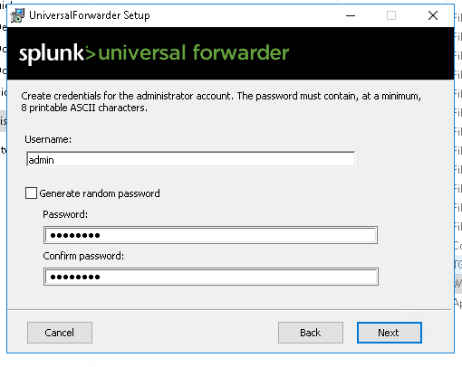

# Installation de splunk

## installation du serveur

L'installation du serveur d'écoute est très simple c'est un packet .deb, il est donc déployabale avec 
```bash
sudo dpkg -i splunk_entreprise.deb
```

il écoute sur le port 8000 et demanderas lors de son installation un mot de passe qui sera utilisée pour la connection à l'interface web.

on peut alors d'y connecter avec:
127.0.0.1, localhost ou elastic.sevenkingdoms.local
```url
elastic.sevenkingdoms.local:8000
```

## déploiement des agents.

j'ai commencé par rajouter les éléments qu'il faudrait télécharger dans le playbook de goad ([goad-dc](../playbooks/goad-dc.yaml) et [goad-srv](../playbooks/goad-srv.yaml))
j'ai donc automatiser la copie avec la syntaxe j2 puis j'ai exécuté les différents éléments:


1. l'installation de winrar<br> 

2. l'exécution de l'installer msi
    1. 
    2. la sélection des crédentiels 
    3. le paramétrage des port de destination ainsi que l'ip du serveur splunk (le même que le serveur elastic)
    
    
    4. l'installation du l'agent 

3. le dépaquetage de l'addon windows avec winrar dans le réportoire de l'agent (c:\Program Files\Splunk Forwarder\etc\apps) 

4. la copie du fichier c:\Program Files\Splunk Forwarder\etc\apps\SplunkTAwindows\default\input.conf
dans un répertoire nouvellement créé c:\Program Files\Splunk Forwarder\etc\apps\SplunkTAwindows\local


5. la modification du fichier inputs.conf ainsi copié (activation des sondes)


6. le redémarrage du service afin de prendre en compte le nouveau fichier de configuration:


## Résultats

on obtient alors les agents qui remontent des données pour chacun des hôtes:

