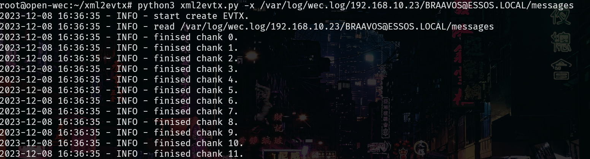
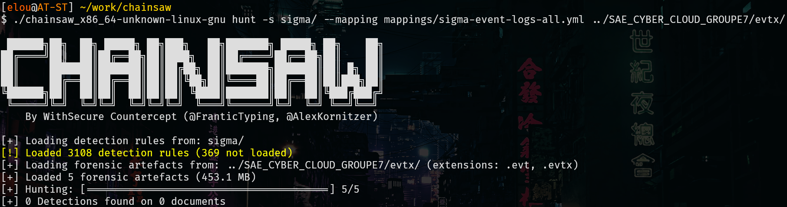
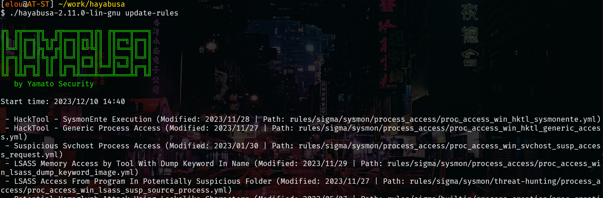
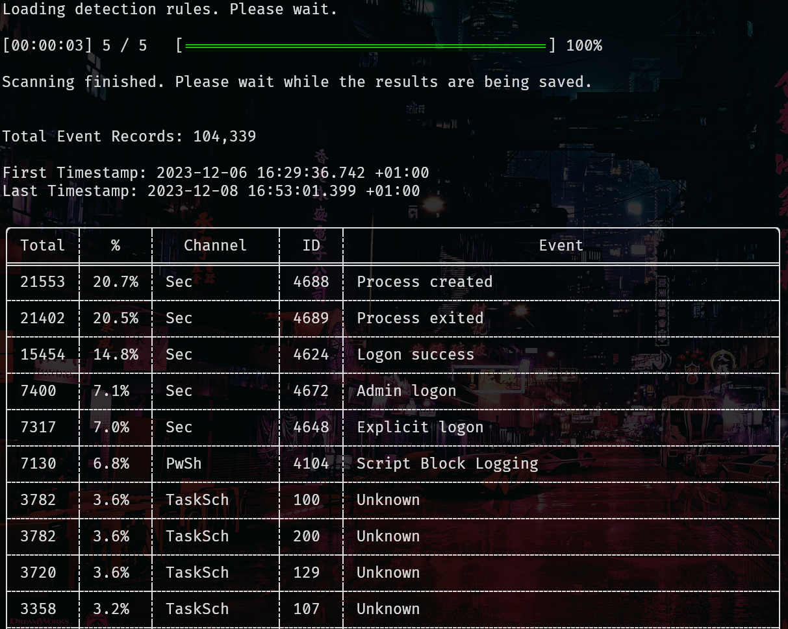
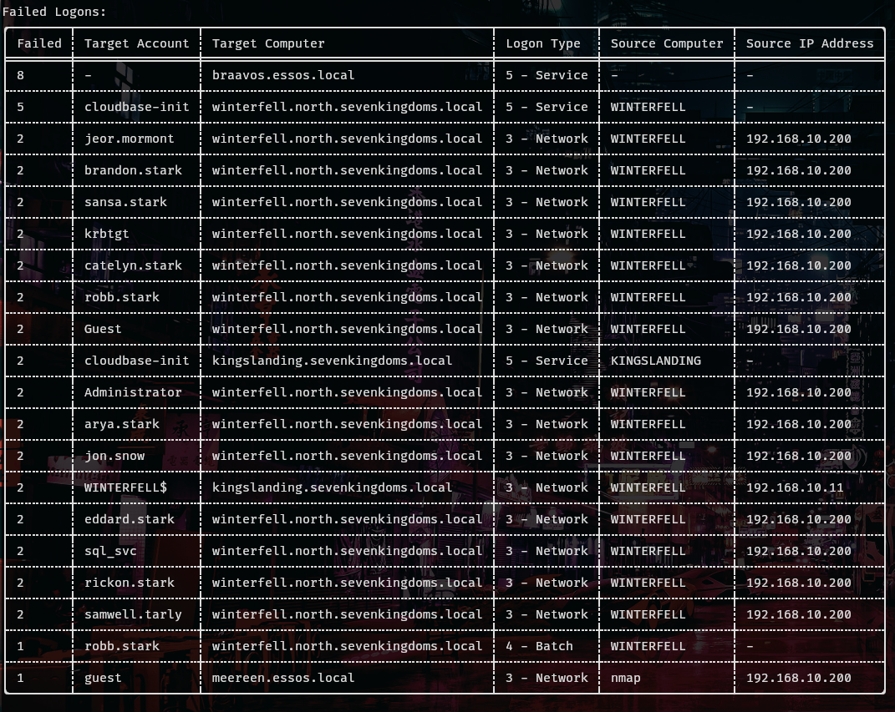

# Analyse des logs avec Chainsaw et Hayabusa

## Conversion du xml en evtx
J'ai pu convertir les logs avec [xml2evtx](https://github.com/JPCERTCC/xml2evtx) :

## Analyse avec chainsaw
L'analyse avec les sigma rules de bases de chainsaw n'a rien donnée :

## Analyse avec hayabusa

J'ai d'abord commencé par mettre à jour les règles de détections d'hayabusa :

On peut déjà faire une liste des événements les plus récurrents :

Mais le plus intéressant est l'analyse des tentatives connexions échouées, on remarque qu'elles viennent toutes de l'ordinateur d'Antoine (192.168.10.200) : 
