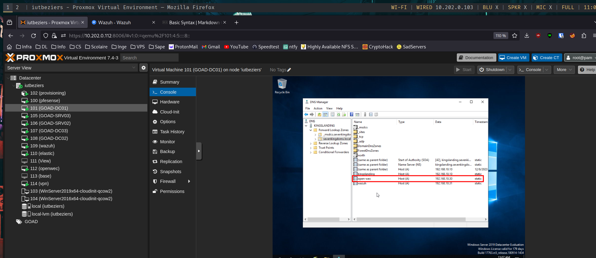
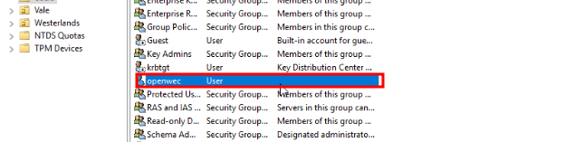
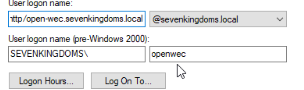
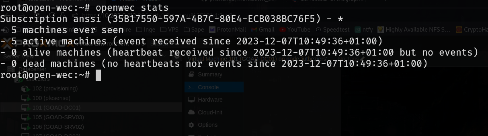

# Openwec

## Préparation sur l'AD

### Ajout du FQDN



### Ajout de l'utilisateur openwec


### Génération du Keytab
```bat
ktpass -out wec.keytab -princ http/open-wec.sevenkingdoms.local@SEVENKINGDOMS.LOCAL -pass wecwecwec -mapuser openwec -mapOp set -crypto All -ptype KRB5_NT_PRINCIPAL
```
On voit que l'utilisateur à bien changé de principal:



## Script ansible
Il suffit ensuite de copier le 'wec.keytab' dans le dossier files du role 'open-wec' puis de lancer la commande pour le [playbook](../playbooks/wef.yml):
```bash
ansible-playbook playbooks/open-wec.yml
```

## Configuration des subscriptions
On télécharge d'abord les règles de l'anssi :
```bash
wget https://raw.githubusercontent.com/ANSSI-FR/guide-journalisation-microsoft/main/Standard_WEC_query.xml
```

Puis on crée la nouvelle subscriptions :
```bash
openwec subscriptions new anssi Standard_WEC_query.xml
```

Ensuite on défini la sortie des logs :
```bash
openwec subscriptions edit anssi outputs add --format json raw /var/log/wec.log
```

Enfin on active la subscription :
```bash
openwec subscriptions enable anssi
```

## Lancement du serveur
```bash
systemctl restart openwec.service
```

## Vérification des events
```bash
openwec stats
```
