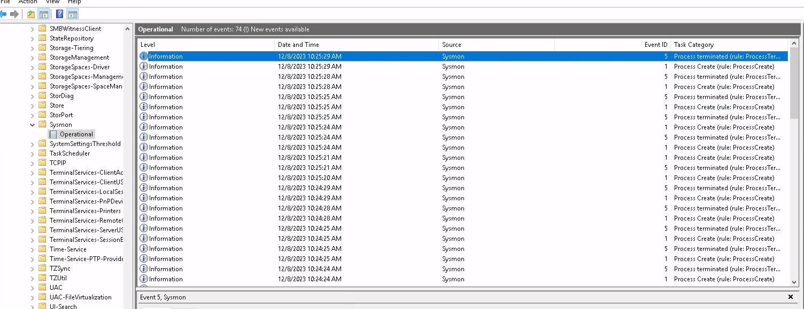

# Sysmon
L'installation de sysmon permet d'avoir des logs Windows plus poussés sur les processus et leur utilisation. Le déploiement est automatisé via [ansible](../playbooks/sysmon.yml) :
```bash
- name: Copy sysmon exe
  ansible.windows.win_copy:
    src: Sysmon64.exe
    dest: C:\Temp\

- name: Install sysmon
  ansible.windows.win_shell: C:\Temp\Sysmon64 -i -accepteula

- name: Remove sysmon exe
  ansible.windows.win_file:
    path: C:\Temp\Sysmon64.exe
    state: absent
```
On voit ensuite les evènement windows :
