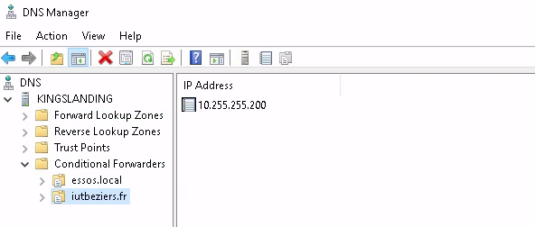
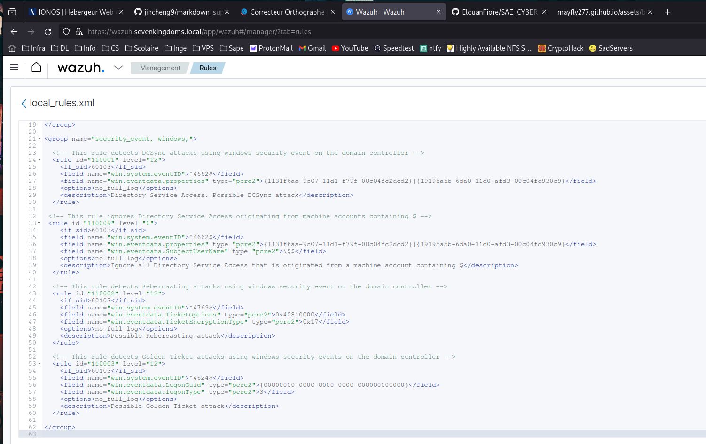

# Serveur Wazuh

## Installation
Pour installer le serveur j'ai suivi la procédure pas à pas de la documentation du Wazuh et j'ai traduit toutes les étapes en tâche ansible. Il est maintenant déployable avec un [playbook](../playbooks/wazuh-server.yml). Pour permettre de télécharger certains paquets plus rapidement j'ai renseigné le miroir Debian de l'IUT et j'ai utilisé un redirecteur conditionnel sur le DNS de DC01 afin de pouvoir l'atteindre par son IP privé :


## Configuration
Malgré toutes les règles déjà configurées de Wazuh, il faut en rajouter pour pouvoir détecter des attaques sur l'active directory :


Les groupes d'agents 'DomainController' et 'WindowsServer' sont eux ajoutés automatiquement pendant l'installation via ansible :
```bash
- name: Run agent groups
  become: yes
  ansible.builtin.command: "bash /var/ossec/bin/agent_groups -a -g {{ item }} -q"
  loop:
    - DomainController
    - WindowsServer
```